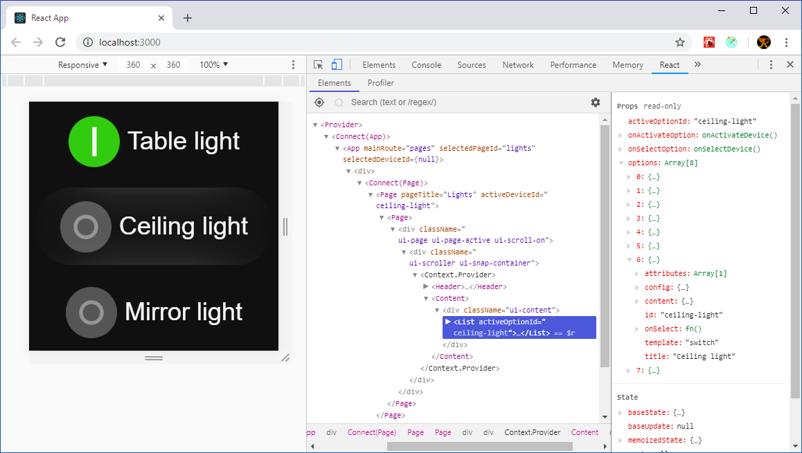
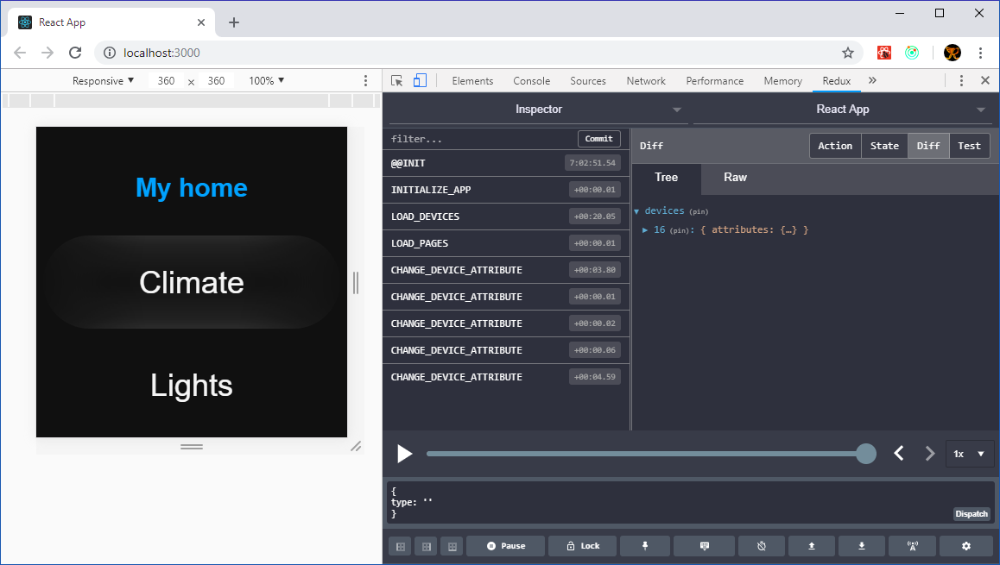
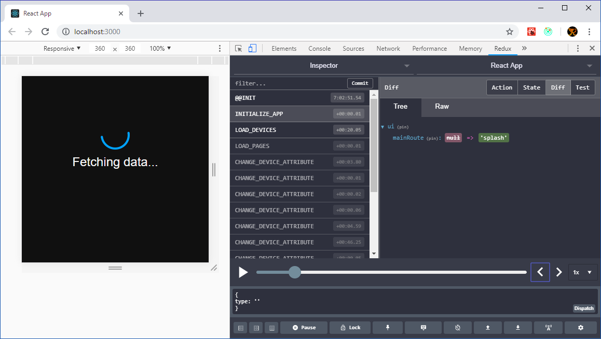

  

## React Tizen Watch
An easy way to create a Tizen Web Application for the Samsung Gear S3. It's using [Create React App](https://github.com/facebook/create-react-app), [Redux](https://github.com/reduxjs) and the [Airbnb JavaScript style guide](https://github.com/airbnb/javascript). This app is a front-end for the [pimatic](https://pimatic.org/) home automation system.

### Development
The application is built using Create React App. The excellent documentation can be found [here](https://facebook.github.io/create-react-app/docs/documentation-intro).
- Run `yarn install` and `yarn start` and start editing the code. While editing, the web application will automatically refresh and reflect the changes.

It is highly advisable to install the [React](https://github.com/facebook/react-devtools) and [Redux](https://github.com/reduxjs/redux-devtools) Developer Tools. In the debugger set the screen resolution to 360 x 360px, that's the screen size of the watch.

Debugging components with the React Developer Tools

Debugging actions and state with the Redux Developer Tools

Time travelling with the Redux Developer Tools

- To run the tests, run `yarn test`.

### Deployment on the watch
- Install [Tizen Studio](https://developer.tizen.org/)
  - From the Main SDK install 2.3.2 Wearable
  - From the Extension SDK install Samsung Certificate Extension
- Create a [Samsung Certificate](http://developer.samsung.com/z/develop/getting-certificates/create)
- Edit tizen-studio\tools\ide\conf\profiles.xml to point to the correct certificates
- Use the tizen cli to set the default profiles path, i.e. `tizen cli-config "default.profiles.path=C:\tizen-studio\tools\ide\conf\profiles.xml"`

- Put the watch in debugging mode
- Connect the watch to the WiFi-network
- Connect to the watch using the connection manager or the sdb cli
- run `yarn install`
- run deploy.ps1